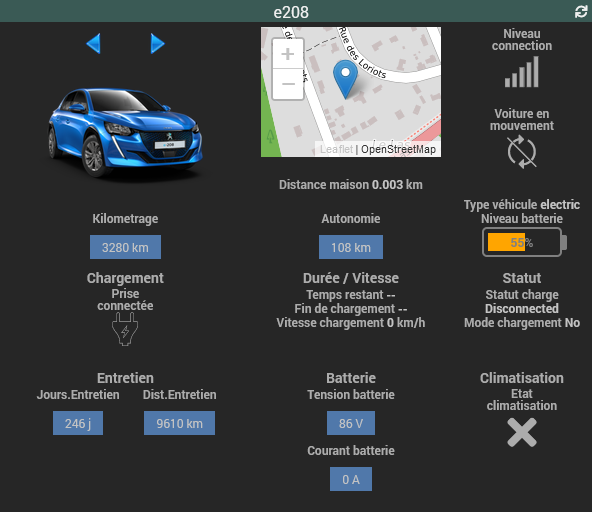
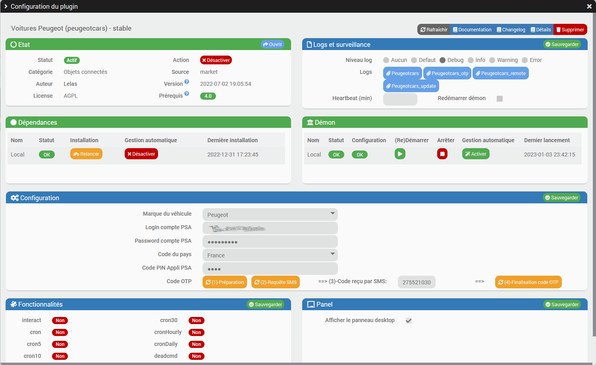
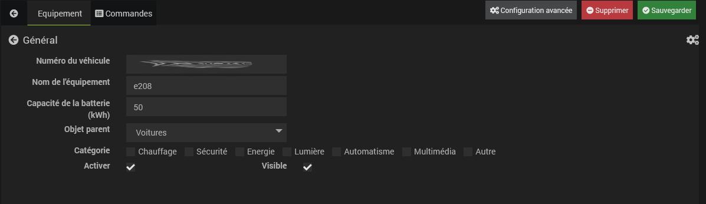
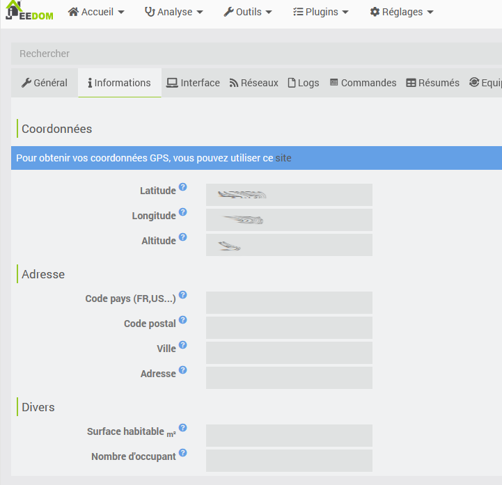
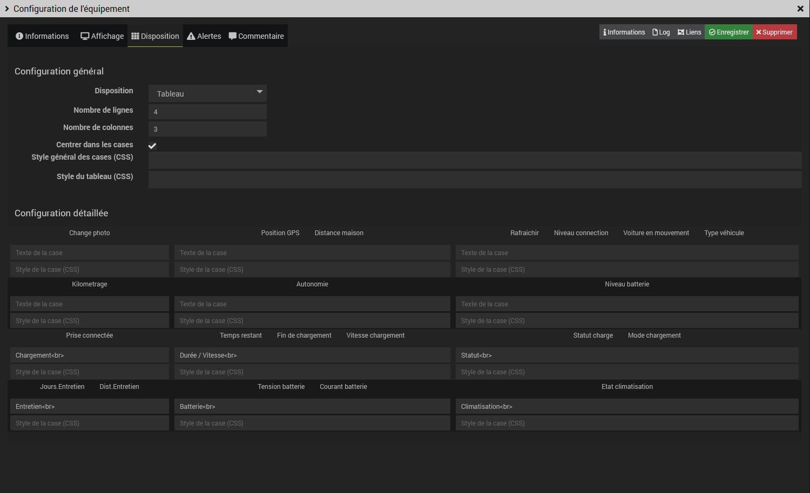
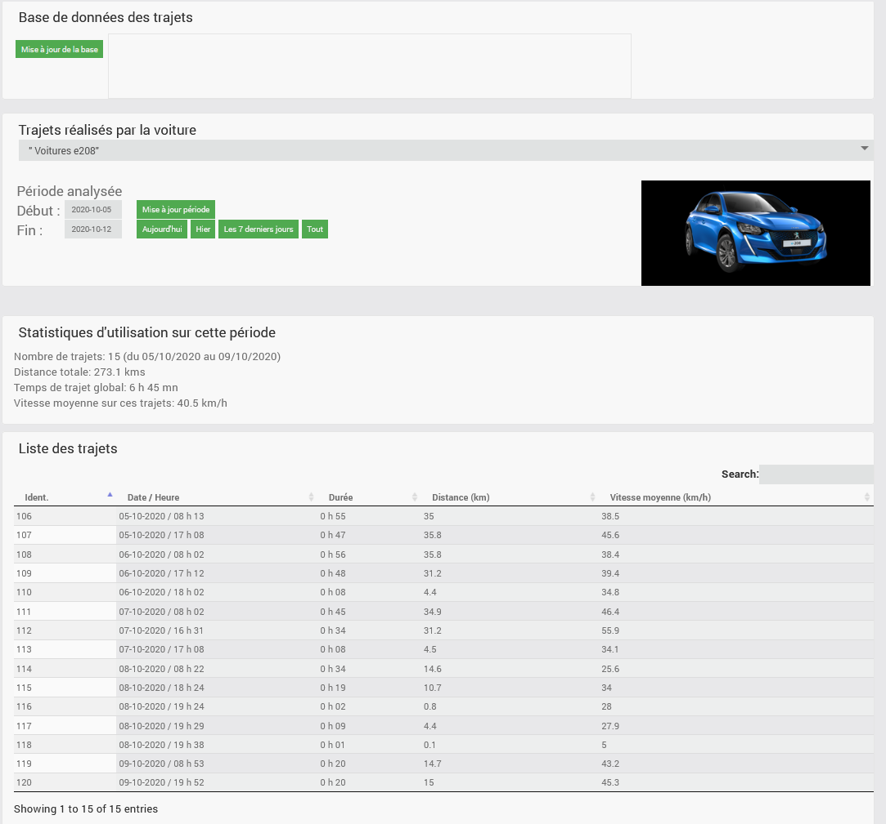
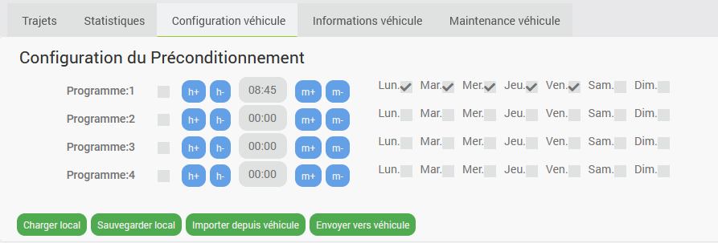
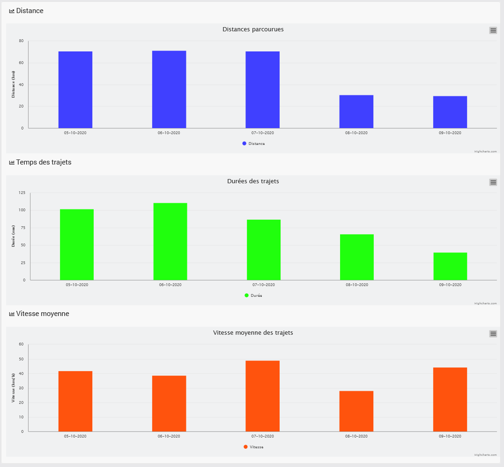

# plugin-PeugeotCars

## Fonctions

Ce plugin permet d'accèder aux informations de votre voiture connectée Peugeot, ainsi qu'à la position GPS courante du véhicule.
Il détermine ainsi les trajets réalisés et enregistre ces trajets dans une base de données.

Les informations disponibles dans le widgets sont:
* Charge de la batterie, autonomie et kilométrage de la voiture
* Information sur le chargement de la batterie (Prise connectée, temps de chargement, vitesse de chargement..)
* Nombre de jours et kilomètres jusqu'au prochain entretien du véhicule
* Situation du véhicule sur une carte (Position GPS), distance au domicile, et information si le véhicule se déplace.

Ce plugin a été développé et testé avec un véhicule Peugeot 208 électrique.  
Il a été testé également sur d'autres 208 électrique, et sur un SUV 3008 hybride.  
Il semble qu'il ne fonctionne pas pour les véhicules thermiques.  
(Il serait intéressant toutefois de le tester sur une voiture 208 thermique de dernière génération) 

  

## Installation
Par source Github:
* Aller dans Jeedom menu Plugins / Gestion des plugins
* Sélectionner le symbole + (Ajouter un plugin)
* Sélectionner le type de source Github (Il faut l'avoir autorisé au préalable dans le menu Réglages / Système / Configuration => Mise à jour/Market)
* Remplir les champs:
  * ID logique du plugin : peugeotcars
  * Utilisateur ou organisation du dépôt : lelas33
  * Nom du dépôt : plugin_peugeotcars
  * Branche : master
* Lorsque l'installation est finie, faire un refresh de la page. Le plugin "Voitures Peugeot" doit apparaitre.
* Sélectionner le plugin et l'activer.

  

Sur la page configuration du plugin, réaliser les opérations suivantes dans l'ordre indiqué:
* Saisir vos identifiants de compte MyPeugeot (Login + Password), puis Sauvegarder la section Configuration
* Dans la section Démon, désactiver la "Gestion automatique". (elle pourra être réactivée ultérieurement, après une activation fonctionnelle)
* Lancer l'installation des dépendances du plugin. (Attention, cette opération peut être assez longue: ~15 mn sur un Raspberry PI)
  * Il est possible de suivre cette phase dans le log dédié: "peugeotcars_update"
* Lorsque cette installation des dépendances est terminée, une requête d'authentification est lancée sur le site PSA, et vous devrez recevoir un code par SMS de STELLANTIS
  * Ce SMS est envoyé au téléphone associé au compte PSA identifié par le login.
* Lorsque le SMS est reçu, saisissez ce code SMS, et le code PIN de l'application téléphone PSA dans les 2 champs correspondants, puis Sauvegarder à nouveau la section Configuration
* cochez la case :"Afficher le panneau desktop", puis Sauvegarder la section Panel. Cela donne accès à la page du "panel" de l'équipement.
* Démarrez le "Démon" en cliquant sur la flèche verte de la section Démon, le statut doit passer à OK (en vert)

## Configuration
Une fois l'installation effectuée: 
Sur l'onglet "**Equipement**", choisissez l'objet parent, et notez le numéro VIN du véhicule (voir sur la carte grise) 
Indiquez également la capacité de la batterie pour un véhicule électrique. (Cela permet d'évaluer la consommation sur un trajet)  
Lors de la sauvegarde de l'équipement, quelques photos du véhicules sont téléchargées et rendues disponibles pour affichage sur le widget. 

  

Il faut saisir ensuite quelques informations complémentaires:
* La capacité de la batterie de votre véhicule (les valeurs proposées sont données en info-bulles)
* La tension nominale de la batterie de votre véhicule (les valeurs proposées sont données en info-bulles)
* Le prix du kWh pour les calculs de cout des trajets
* Sélectionner la case "Détection alternative des trajets" si l'API ne fourni plus d'information de position GPS et de véhicule en mouvement. Cette option permet de détecter les trajets par un autre moyen. 

Pour le moment, la section "Configuration pour la charge" n'est pas utilisée. Ne rien remplir dans ces champs 

La page du panel à besoin de connaitre les coordonnées GPS de stationnement habituel de la voiture afin de centrer la carte pour l’affichage des trajets.  
Pour cela, il faut renseigner ces coordonnées GPS dans la page de configuration de jeedom.  
Règlages => Système => Configuration => Informations  

  

## Widget
Le widget est configuré automatiquement par le plugin lors de la création de l'équipement.
Une photo du véhicule doit s'afficher sur le widget. On peut en changer avec les 2 flèches bleues.
Il est possible d'agencer les éléments dans le widgets par la fonction d'édition du dashboard. 
Je propose l'agencement suivant comme exemple, en utilisant la présentation en tableau dans Configuration Avancée=>Disposition (voir ci dessous)  
Lorsque l'on clique sur la photo, on bascule sur la page "Panel" du plugin associée au véhicule.

  

## Panel
Une page de type "panel" est disponible pour le plugin dans le menu Acceuil de jeedom.  
Cette page permet de consulter les informations suivantes sur 5 onglets différents:
* Liste des trajets effectués par le véhicule
* Statistiques sur l'utilisation et la consommation du véhicule. 
* Configuration du véhicule
* Quelques informations sur le véhicule
* Informations sur les visites d'entretien du véhicule recommandées par Peugeot

**Affichage des trajets:**
Il est possible de définir une période soit par 2 dates, soit par des racourcis ('Aujourd'hui', 'hier', 'les 7 derniers jours' ou 'tout'), puis d'afficher l'ensemble des trajets sur cette période. 
La suite de la page est mise à jour avec l'affichage des trajets sélectionnés, en tableau et en affichage sur une carte. (Openstreet map)  
On peut sélectionner les trajets 1 par 1 dans le tableau pour afficher un seul trajet dans la liste.  
Un résumé sur l'ensemble des trajets sélectionnés et donné également sur cette page.

  

**Statistiques:**
Présentations sous forme de graphe de quelques statistiques d'utilisation du véhicule, basées sur l'historique des trajets mémorisés.

* Distances parcourues 
* Consommation du véhicule au 100 km
* Energie consommée et coût estimé

**Configuration véhicule:**
Cette page permet de définir les programmes de gestion du préconditionnement.  
Il y a en effet 4 programmes hebdomadaires possibles. Pour chaque programme, on peut choisir l'heure d'activation, ainsi que les jours d'application. 
Il y a 4 actions possibles sur ces programmes.
* "Charger local": Chargement des programmes depuis un fichier local de sauvegarde dans votre jeedom
* "Sauvegarder local": Sauvegarde des programmes vers ce fichier local de sauvegarde dans votre jeedom
* "Importer depuis véhicule": Chargement des programmes depuis le véhicule (Fait automatiquement lorsque l'on ouvre cette page)
* "Envoyer vers véhicule": Envoie des programmes vers le véhicule

  

**Informations sur le véhicule:**
Quelques informations sont données sur le véhicule
En particulier la dernière version du logiciel disponible

  

**Visites d'entretien:**
Liste des 3 prochaines opérations d'entretien du véhicule, avec leur date ou kilométrage prévisionels
Les opérations principales d'entretion sont données également. : plus fonctionnel pour le moment

  

**Bugs connus:**
..

**Suite prévue pour ce plugin:**
* Ajouter d'autres types de véhicules du groupe PSA
